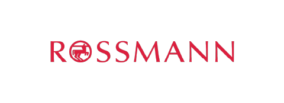
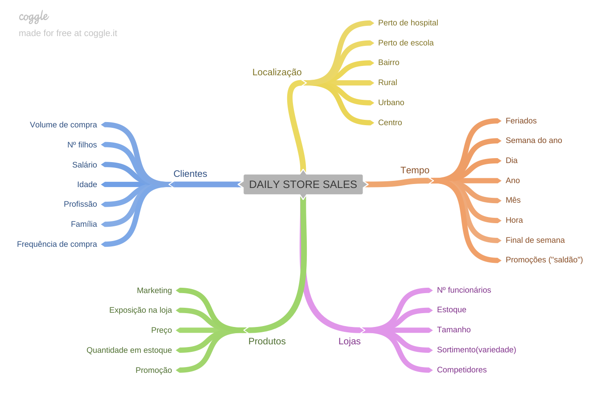

# Predição de vendas - Rossmann

> O projeto foi desenvolvido com o objetivo de fazer a previsão das vendas de cada uma das lojas da rede Rossmann para os próximos 42 dias (6 semanas) utilizando técnicas de Machine Learning. Os resultados podem ser acessados em [Streamlit App](https://approssmann-prediction.streamlit.app/).

A rede de farmácias **Rosmann** está iniciando um planejamento de custos para determinar quanto será destinado para **custear melhorias e outros investimentos em cada loja** (reformas, campanhas de marketing, novas contratações, aumento de estoque, entre outros custos). Para que possam ser mais assertivos, os tomadores de decisão solicitaram uma **previsão** de quanto será a **receita de cada loja nas próximas 6 semanas** para estipular o valor que cada uma receberá, a fim de que os investimentos realizados tenham o maior retorno possível.

Os dados utilizados no projeto podem ser acessado em [Rossmann Store Sales](https://www.kaggle.com/competitions/rossmann-store-sales/data)

## 📄 Metodologia

Para a construção da solução será apliocada a metodologia **CRISP-DM**(Cross Industry Standard Process for Data Mining), que sugere as seguintes etapas:

- Entendimento do negócio
- Entendimento dos dados
- Preparação dos dados
- Modelagem
- Avaliação e validação
- Deploy do modelo (colocar em produção)

  

## 📂 Estrutura do Projeto

- `data/` - Contém os datasets utilizados no projeto
- `api/` - Arquivos necessários para a API que irá acessar as predições
- `img/` - Imagens usadas no Jupyter Notebook e no README
- `model/` - Modelo treinado
- `parameter/` - Parâmetros treinados 
- `notebook/` - Jupyter Notebook usado para desenvolver o projeto
- `requirements.txt` - Arquivo com as bibliotecas e versões utilizadas no projeto
- `README.md` - Documentação do projeto

## 📋 Prepação dos dados

Foram aplicadas transformações para renomear colunas para que tivessem o mesmo padrão, foram conferidos e tratados valores nulos, conversão de tipos de colunas para os tipos mais adequados. Também foi utilizada estatística descritiva para entender melhor os dados e se havia algum insight inicial neles.

## 📊 Feature Engineering e EDA
Inicialmente, foram criadas hipóteses sobre a relação das vendas (`sales`) com outras caractetíricas presentes do conjunto de dados como: tamanho da loja, variedade de protudos vendidos, dia da semana, distância de lojas concorrentes, entre outros. 

  

Houve a necessidade de criar algumas features derivadas das features iniciais para que fossem analisadas as hipóteses criadas. Também foi necessário a filtragem de algumas variáveis, como a exclusão de lojas fechadas.
Foram realizadas análises univariadas, bivariadas e multivariadas para analisar e validar as hipóteses.

## 📔 Modelagem dos dados
Para que os dados sejam utilizados da melhor maneira pelos modelos de Machine Learning, foram feitas algumas transformações como: rescaling, encondings e transformação de natureza.
> O aprendizado da maioria dos algoritmos de Machine Learning é facilitado com dados numéricos e na mesma escala.

Foi realizada também a seleção de features que serão utilizadas no treinamento dos modelos, unindo o resultado de seleção de features do algoritmo `Boruta` e a percepção sobre a importância de algumas features notada da EDA.

## 💻 Modelos de ML
Foram treinados alguns dos modelos mais comuns utilizados nos problemas de regressão (`LinearRegression`, `Lasso`, `RandomForestRegressor`, `XGBoostRegressor`) e foram coletadas métricas dos resultados obtidos pela `TimeSeriesSplit` (validação cruzada para Séries Temporais).
*Apesar do `RandomForestRegressor` ter apresentado os melhores resultados, foi escolhido o `XGBoost` para a finalização do projeto, por ser um modelo mais leve e eficiente.*
### Tunagem de Hiperparâmetros
Após a escolha do modelo de ML, foi utilizado um algoritmo de Random Search (`RandomizedSearchCV`) para ajudar a encontrar os melhores parâmetros para o modelo. **Os hiperparâmetros encontrados pelo Random Search resultaram em uma melhora de 15.09 % na performance do modelo.** Foi escolhido o Random Search por ser mais rápido e exigir menos recursos computacionais que outras opções como Grid Search e Bayesian Search.

## 🎯 Disponibilização da predição(API)
Para que os tomadores de decisão e outros usuários possam ter acesso ao valor de vendas previsto de cada loja foi desenvolvido um app no Streamlit que acessa a API do deploy do modelo.

## 🚀 Considerações finais e próximos passos
O projeto foi desenvolvido de acordo com o que foi proposto no curso "DS em Produção" da Comunidade DS. Por ser um projeto voltado ao aprendizado de ciência de dados, algumas etapas desenvolvidas no Jupyter Notebook tiveram a finalidade de apresentar abordagens iniciais para os problemas da área e familiarizar o aluno com alguns conceitos. 
Portanto, há muito o que melhorar no projeto, sendo possíveis como **próximos passos**:
- Utilizar outros algoritmos que lidem melhor com séries temporais
- Revisar os tratamentos realizados nos dados para se adequarem melhor ao problema de séries temporais
- Testar a criação de novas features
- Utilização de `Pipeline` 
- Utilização de GridSerach para tunagem dos hiperparâmetros
- Adição de mais informações relevantes no app do Streamlit
- Utilizalçao de `Poetry` para gerenciar pacotes

## 🔧 Ferramentas e Tecnologias utilizadas
*Coleta de dados*

*Desenvolvimento*

*API e app*

*Documentação e versionamento*

## 📩 Contato

Caso tenha dúvidas, entre em contato pelo meu [LinkedIn](https://www.linkedin.com/in/marcela-de-pretto-amorim/).
