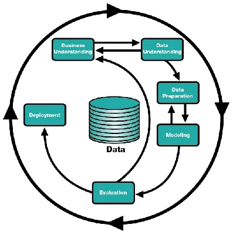

# Predição de vendas - Rossmann

A rede de farmácias **Rosmann** está iniciando um planejamento de custos para o ano seguinte. Para determinar quanto será destinado para custear cada loja (reformas, campanhas de marketing, novas contratações, aumento de estoque, entre outros custos), os tomadores de decisão precisam de uma **previsão** de quanto será a **receita de cada loja nas próximas 6 semanas** para estipular o valor que cada uma receberá, a fim de que os investimentos realizados tenham o maior retorno possível.

O projeto tem como objetivo realizar a previsão de faturamento das lojas da rede Rossmann utilizando técnicas de Machine Learning.

## 📄 Metodologia

Para a construção da solução será apliocada a metodologia CRISP-DM(Cross Industry Standard Process for Data Mining), que sugere as seguintes etapas:

- Entendimento do negócio
- Entendimento dos dados
- Preparação dos dados
- Modelagem
- Avaliação e validação
- Deploy do modelo (colocar em produção)

## 📂 Estrutura do Projeto

- `data/` - Contém os datasets utilizados no projeto
- `notebooks/` - Jupyter Notebooks com as análises
- `src/` - Código-fonte do projeto
- `README.md` - Documentação do projeto

## 🚀 Como rodar o projeto

1. Clone o repositório:
   <https://github.com/MarcelaPrettoAmorim/prediction_rossmann.git>

2. Instale as dependências:
   pip install -r requirements.txt

📊 Tecnologias usadas

- Python
- Pandas
- Scikit-Learn
- Matplotlib
- TensorFlow

📩 Contato

Caso tenha dúvidas, entre em contato pelo meu [LinkedIn](https://www.linkedin.com/in/marcela-de-pretto-amorim/).
